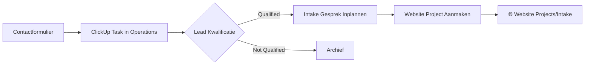
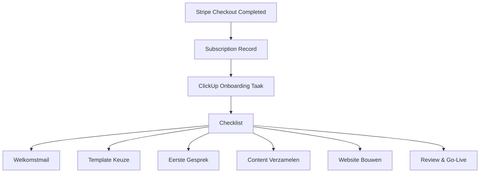

# ClickUp Space Analyse: abonnement.website

## Huidige Structuur

### Space Details
- **Naam**: 🌐 Abonnement.website
- **Space ID**: 90159033136

### Folders & Lijsten

| Folder | Folder ID | Lijsten |
|--------|-----------|---------|
| 🌐 Website Projects | 901512856815 | Active Projects |
| 📦 Templates | 901512856816 | (leeg) |

### Space-Level Lijsten (Interne Operations)

| Lijst | ID | Doel |
|-------|-----|------|
| Product Overview | 901519034021 | Product backlog, features |
| Development | 901519034023 | Bug fixes, development tasks |
| Operations | 901519034022 | Dagelijkse operaties, support |
| Recurring | 901519034024 | Terugkerende taken |
| Done/Archive | 901519034025 | Afgeronde taken |

---

## 1. Website Project Structuur (Aanbeveling)

### Folder: 🌐 Website Projects

Organiseer klantprojecten per fase in de customer journey (gebaseerd op de 4-stappen flow):

```
🌐 Website Projects/
├── 📋 Intake & Briefing (Stap 1)
│   └── Nieuwe leads die kennismakingsgesprek moeten inplannen
├── 🎨 Design & Development (Stap 2)
│   └── Websites in ontwerp/bouwfase
├── 👁️ Review & Feedback (Stap 3)
│   └── Klant moet goedkeuren, feedback verwerken
├── 🚀 Live Websites (Stap 4)
│   └── Actieve klanten met live website
└── 📊 Maintenance
    └── Maandelijks onderhoud, updates, optimalisaties
```

### Aanbevolen Custom Fields per Project

| Veld | Type | Waarden |
|------|------|---------|
| Plan Type | Dropdown | Starter (€99), Professional (€199), Enterprise |
| Template | Dropdown | Horeca, Kapsalon, Bouw, Medisch, Retail |
| Klant Email | Email | - |
| Bedrijfsnaam | Text | - |
| Maandelijkse Omzet | Currency | - |
| Go-Live Datum | Date | - |
| Specialist | Person | - |
| Add-ons | Labels | Google Ads, Meta Ads, SEO, Content |

### Statussen per Lijst

**Intake & Briefing:**
- To Do → Gesprek Gepland → Info Ontvangen → Klaar voor Design

**Design & Development:**
- To Do → In Ontwerp → In Development → Klaar voor Review

**Review & Feedback:**
- Wacht op Feedback → Feedback Ontvangen → Aanpassingen → Goedgekeurd

**Live Websites:**
- Actief → Onderhoud Gepland → In Onderhoud

---

## 2. Template Library Organisatie

### Folder: 📦 Templates

Maak een lijst per template categorie met taken als checklist-items:

```
📦 Templates/
├── 🍽️ Horeca Templates
│   ├── Horeca Starter (LOW plan)
│   └── Restaurant Pro (MEDIUM plan)
├── 💇 Beauty & Wellness Templates
│   ├── Kapsalon Pro (LOW plan)
│   └── Spa Premium (MEDIUM plan)
├── 🏗️ Bouw & Techniek Templates
│   └── Bouw & Renovatie (MEDIUM plan)
├── 🏥 Zorg & Gezondheid Templates
│   └── Medisch Praktijk (MEDIUM plan)
└── 🛒 Retail Templates
    └── Retail & Winkel (LOW plan)
```

### Template Task Structuur

Elk template als taak met subtaken:

```markdown
📄 Horeca Starter
├── Homepage design mockup
├── Menu pagina layout
├── Reserveringssysteem integratie
├── Foto galerij component
├── Contactformulier
├── SEO basis setup
└── Mobile responsive check
```

### Custom Fields voor Templates

| Veld | Type | Doel |
|------|------|------|
| Plan Eligibility | Dropdown | LOW / MEDIUM / HIGH |
| Category | Dropdown | Horeca, Beauty, Bouw, etc. |
| Is Featured | Checkbox | Homepage weergave |
| Estimated Hours | Number | Ontwikkeltijd |
| Preview URL | URL | Demo website link |

---

## 3. Client Request Workflows

### A. Nieuwe Lead Flow (Contact Formulier)



**Automatisering (reeds geïmplementeerd):**
- Contact form → Automatische taak in Operations lijst
- Tags: `contact`, `lead`
- Priority: HIGH

### B. Nieuwe Klant Onboarding Flow



**Aanbevolen Onboarding Checklist:**
1. ✅ Welkomstmail verzenden (dag 0)
2. ✅ Template keuze bevestigen (dag 1-2)
3. ✅ Kennismakingsgesprek (dag 1-2)
4. ✅ Content brief versturen (dag 3)
5. ✅ Content ontvangen & verwerkt (dag 5)
6. ✅ Website design presentatie (dag 6-8)
7. ✅ Feedback verwerken (dag 8-9)
8. ✅ Go-live & training (dag 10)

### C. Support Request Flow

```
Klant Email/Telefoon
        ↓
Operations Lijst (Priority: NORMAL)
        ↓
Triage door Team
        ↓
┌─────────────────────────────────────┐
│ Bug → Development lijst             │
│ Content wijziging → Operations      │
│ Nieuwe feature → Product Overview   │
│ Facturatie → Operations (URGENT)    │
└─────────────────────────────────────┘
```

### D. Maandelijks Onderhoud Flow

```
Recurring Lijst (MONTHLY tag)
        ↓
┌─────────────────────────────────────┐
│ Per klant:                          │
│ • Uptime check                      │
│ • Plugin/security updates           │
│ • Performance monitoring            │
│ • Analytics rapport                 │
│ • SEO check (Professional+)         │
│ • Optimalisatie suggesties          │
└─────────────────────────────────────┘
        ↓
Rapport naar klant dashboard
```

---

## 4. Super Agent Aanbevelingen

### Automation Rules (ClickUp Native)

| Trigger | Actie |
|---------|-------|
| Taak naar "Complete" | Verplaats naar Done/Archive |
| Nieuwe taak met tag "lead" | Notify team via email |
| Due date morgen | Stuur reminder |
| Taak > 3 dagen in "In Progress" | Escaleer prioriteit |

### Externe Integraties

| Tool | Integratie Doel |
|------|-----------------|
| **Stripe** | Nieuwe subscription → Onboarding taak |
| **Website Platform** | Support ticket → ClickUp taak |
| **Google Analytics** | Wekelijks rapport → Klant taak |
| **Uptime Robot** | Downtime alert → URGENT taak |

### Dashboard Views

**1. Teamlid Dashboard**
- Mijn taken vandaag
- Overdue items
- Klanten in Review fase

**2. Management Dashboard**
- Pipeline: Leads → Klanten conversie
- MRR per plan type
- Gemiddelde onboarding tijd
- Klanttevredenheid scores

**3. Klant Overview (per klant)**
- Project status
- Openstaande taken
- Laatste activiteit
- Volgende milestone

### Aanbevolen Tags Structuur

| Categorie | Tags |
|-----------|------|
| **Lead Status** | lead, qualified, not-qualified, converted |
| **Plan Type** | starter, professional, enterprise |
| **Urgentie** | urgent, can-wait, scheduled |
| **Type Werk** | design, development, content, seo, ads |
| **Add-ons** | google-ads, meta-ads, seo, content-creation |

---

## 5. Implementatie Stappenplan

### Fase 1: Structuur Optimalisatie (Week 1)

- [ ] Nieuwe lijsten aanmaken in Website Projects folder
- [ ] Custom fields configureren
- [ ] Statussen per lijst instellen
- [ ] Template library opzetten in Templates folder

### Fase 2: Automations (Week 2)

- [ ] Lead → Onboarding automation
- [ ] Due date reminders
- [ ] Status change notifications
- [ ] Stripe webhook → ClickUp integratie

### Fase 3: Reporting (Week 3)

- [ ] Dashboard views configureren
- [ ] Wekelijkse/maandelijkse rapporten
- [ ] KPI tracking setup

### Fase 4: Team Training (Week 4)

- [ ] Workflow documentatie
- [ ] Team onboarding op ClickUp
- [ ] Process verfijning

---

## API Configuratie

### Huidige Server Integratie

```typescript
// server/clickup.ts
export const CLICKUP_LISTS = {
  PRODUCT_OVERZICHT: "901519034021",
  DEVELOPMENT: "901519034023",
  OPERATIONS: "901519034022",
  RECURRING: "901519034024",
  DONE_ARCHIVE: "901519034025",
};
```

### Uitbreiden voor Website Projects

```typescript
export const CLICKUP_PROJECT_LISTS = {
  INTAKE: "...",      // Nieuwe lijst ID na aanmaak
  DESIGN: "...",      // Nieuwe lijst ID na aanmaak
  REVIEW: "...",      // Nieuwe lijst ID na aanmaak
  LIVE: "...",        // Nieuwe lijst ID na aanmaak
  MAINTENANCE: "...", // Nieuwe lijst ID na aanmaak
};
```

---

## Conclusie

De huidige ClickUp structuur biedt een solide basis. De aanbevelingen richten zich op:

1. **Klantgerichte projectorganisatie** - Volg de 4-stappen customer journey
2. **Template library** - Gestructureerde verzameling per industrie
3. **Geautomatiseerde workflows** - Minimaliseer handmatig werk
4. **Transparante reporting** - Dashboards voor team én management

Deze structuur ondersteunt de kernbelofte van abonnement.website: **"Wij regelen alles, u focust op uw bedrijf"**.
